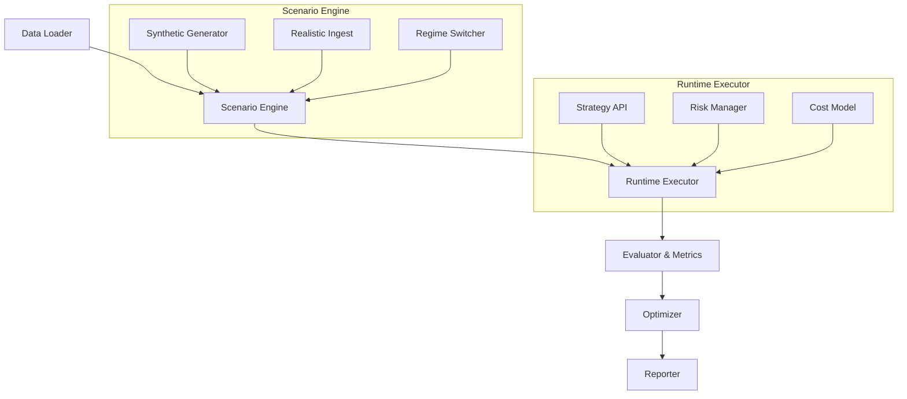

# 📖 Quantum Felix Documentation

Welcome to the comprehensive documentation for Quantum Felix. This guide will help you understand, install, and effectively use the simulation engine.

## 🚀 Quick Start Guide

### Installation

```bash
# Clone the repository
git clone https://github.com/Daniele-Cangi/Quantum-Felix.git
cd Quantum-Felix

# Install dependencies
pip install -r requirements.txt

# Install the package in development mode
pip install -e .
```

### Basic Usage

```python
from felix import QuantumFelix
from felix.strategies import MeanRevertStrategy
from felix.scenarios import MarketScenario

# Initialize the simulation engine
engine = QuantumFelix()

# Create a market scenario
scenario = MarketScenario(
    duration=252,  # Trading days
    assets=['BTC', 'ETH', 'SOL'],
    regime_switching=True
)

# Define your strategy
strategy = MeanRevertStrategy(
    lookback_window=20,
    entry_threshold=2.0,
    exit_threshold=0.5
)

# Run the simulation
results = engine.run_simulation(
    scenario=scenario,
    strategy=strategy,
    seeds=range(10)  # Multiple random seeds
)

# Analyze results
print(results.summary())
```

## 🧩 Architecture Overview

### Core Components



### Module Structure

```
felix/
├── data/              # Data loading and validation
│   ├── loaders.py     # Data source connectors
│   ├── validators.py  # Data quality checks
│   └── preprocessors.py # Data cleaning and transformation
├── scenarios/         # Scenario generation
│   ├── synthetic.py   # Synthetic data generators
│   ├── realistic.py   # Historical data replay
│   └── hybrid.py      # Combined approaches
├── strategies/        # Strategy implementations
│   ├── base.py        # Base strategy class
│   ├── examples/      # Example strategies
│   └── ml/            # Machine learning strategies
├── runtime/           # Execution engine
│   ├── executor.py    # Main simulation runner
│   ├── quantum_cat.py # Quantum early stopping
│   └── scheduler.py   # Task scheduling
├── evaluate/          # Performance evaluation
│   ├── metrics.py     # Performance metrics
│   ├── risk.py        # Risk calculations
│   └── attribution.py # Performance attribution
├── optimize/          # Parameter optimization
│   ├── sweepers.py    # Parameter sweeps
│   ├── optimizers.py  # Optimization algorithms
│   └── hyperopt.py    # Hyperparameter tuning
└── report/            # Results reporting
    ├── exporters.py   # Data export utilities
    ├── visualizers.py # Plotting and charts
    └── templates/     # Report templates
```

## 🔁 Scenario Engine

### Creating Custom Scenarios

```python
from felix.scenarios import BaseScenario
import numpy as np

class CustomVolatilityScenario(BaseScenario):
    def __init__(self, base_vol=0.2, vol_regime_prob=0.05):
        super().__init__()
        self.base_vol = base_vol
        self.vol_regime_prob = vol_regime_prob
        
    def generate_returns(self, n_periods):
        """Generate returns with volatile regime switching"""
        returns = np.zeros(n_periods)
        current_vol = self.base_vol
        
        for i in range(n_periods):
            # Regime switching logic
            if np.random.random() < self.vol_regime_prob:
                current_vol *= np.random.choice([0.5, 2.0])
                
            # Generate return
            returns[i] = np.random.normal(0, current_vol)
            
        return returns
```

### Scenario Configuration

```yaml
# scenario_config.yaml
scenario:
  type: "hybrid"
  duration: 252
  assets: ["BTC", "ETH", "SOL"]
  
  synthetic:
    base_return: 0.0001
    base_volatility: 0.02
    regime_switching: true
    shock_probability: 0.01
    
  realistic:
    data_source: "yahoo"
    start_date: "2020-01-01"
    end_date: "2023-12-31"
    
  hybrid:
    synthetic_weight: 0.3
    realistic_weight: 0.7
```

## 🧭 Strategy Development

### Base Strategy Class

```python
from felix.strategies import BaseStrategy

class MyStrategy(BaseStrategy):
    def __init__(self, **params):
        super().__init__(**params)
        self.position = 0
        self.history = []
        
    def initialize(self, context):
        """Called once at the start of simulation"""
        context.lookback = self.params.get('lookback', 20)
        context.threshold = self.params.get('threshold', 2.0)
        
    def handle_data(self, context, data):
        """Called for each time step"""
        current_price = data.current('price')
        
        # Calculate signal
        if len(self.history) >= context.lookback:
            mean_price = np.mean(self.history[-context.lookback:])
            signal = (current_price - mean_price) / mean_price
            
            # Generate orders
            if signal > context.threshold and self.position <= 0:
                return self.order_target_percent(0.5)  # Long position
            elif signal < -context.threshold and self.position >= 0:
                return self.order_target_percent(-0.5)  # Short position
                
        self.history.append(current_price)
        return None
        
    def analyze(self, context, performance):
        """Called at the end of simulation"""
        print(f"Final return: {performance.total_return:.2%}")
        print(f"Sharpe ratio: {performance.sharpe:.2f}")
```

### Machine Learning Strategies

```python
from felix.strategies.ml import MLStrategy
from sklearn.ensemble import RandomForestRegressor

class MLMomentumStrategy(MLStrategy):
    def __init__(self):
        super().__init__()
        self.model = RandomForestRegressor(n_estimators=100)
        
    def prepare_features(self, data):
        """Create features for ML model"""
        features = []
        for window in [5, 10, 20]:
            features.append(data['returns'].rolling(window).mean())
            features.append(data['returns'].rolling(window).std())
            
        return np.column_stack(features)
        
    def train_model(self, features, targets):
        """Train the ML model"""
        self.model.fit(features, targets)
        
    def predict(self, features):
        """Generate predictions"""
        return self.model.predict(features.reshape(1, -1))[0]
```

## 🐈 Quantum Early Stopping

### Understanding the Algorithm

The Quantum Early Stopping mechanism uses probability amplitudes inspired by quantum mechanics:

```python
class QuantumEarlyStopping:
    def __init__(self, patience=10, min_delta=0.001):
        # Quantum state amplitudes
        self.psi_alive = 1.0  # Continue training
        self.psi_dead = 0.0   # Stop training
        
        # Configuration
        self.patience = patience
        self.min_delta = min_delta
        self.best_score = -np.inf
        self.wait_counter = 0
        
    def update_state(self, current_score):
        """Update quantum state based on performance"""
        # Calculate improvement and fidelity
        improvement = current_score - self.best_score
        fidelity = self.calculate_fidelity(current_score)
        
        # Update amplitudes based on quantum mechanics
        self.psi_alive, self.psi_dead = self.evolve_state(
            improvement, fidelity
        )
        
        # Collapse the wavefunction (make decision)
        collapse_prob = abs(self.psi_dead) ** 2
        return np.random.random() > collapse_prob
        
    def calculate_fidelity(self, current_score):
        """Measure how well current state aligns with best past states"""
        if self.best_score == -np.inf:
            return 1.0
            
        # Normalized fidelity measure
        return max(0, min(1, current_score / self.best_score))
        
    def evolve_state(self, improvement, fidelity):
        """Update quantum amplitudes using Schrödinger-like evolution"""
        # Improvement factor influences alive amplitude
        alive_factor = 1.0 + np.tanh(improvement / self.min_delta)
        
        # Fidelity influences the state stability
        coherence = fidelity * alive_factor
        
        # Normalize to maintain probability conservation
        norm = np.sqrt(alive_factor**2 + (1-coherence)**2)
        
        return alive_factor / norm, (1-coherence) / norm
```

### Configuration Options

```python
# Quantum early stopping configuration
quantum_config = {
    'patience': 15,           # Maximum wait periods
    'min_delta': 0.001,       # Minimum improvement threshold
    'fidelity_weight': 0.7,   # How much to weight fidelity vs improvement
    'coherence_decay': 0.95,  # State coherence decay rate
    'collapse_threshold': 0.8 # Probability threshold for stopping
}

strategy = MyStrategy(quantum_stopping=quantum_config)
```

## 📊 Performance Evaluation

### Metrics Calculation

```python
from felix.evaluate import PerformanceEvaluator

evaluator = PerformanceEvaluator()

# Basic metrics
total_return = evaluator.total_return(returns)
sharpe_ratio = evaluator.sharpe_ratio(returns, risk_free_rate=0.02)
max_drawdown = evaluator.max_drawdown(returns)

# Advanced metrics
sortino_ratio = evaluator.sortino_ratio(returns)
calmar_ratio = evaluator.calmar_ratio(returns)
stability_index = evaluator.stability_index(returns)

# Risk metrics
var_95 = evaluator.value_at_risk(returns, confidence=0.95)
expected_shortfall = evaluator.expected_shortfall(returns, confidence=0.95)

# Performance attribution
factor_exposure = evaluator.factor_attribution(
    returns, 
    factors=['market', 'size', 'value', 'momentum']
)
```

### Custom Metrics

```python
from felix.evaluate.metrics import BaseMetric

class CustomSharpeRatio(BaseMetric):
    def __init__(self, risk_free_rate=0.02, annualization=252):
        self.risk_free_rate = risk_free_rate
        self.annualization = annualization
        
    def calculate(self, returns):
        excess_returns = returns - self.risk_free_rate / self.annualization
        return np.sqrt(self.annualization) * np.mean(excess_returns) / np.std(excess_returns)

# Register custom metric
evaluator.register_metric('custom_sharpe', CustomSharpeRatio())
```

## 🛠️ Configuration Management

### YAML Configuration Files

```yaml
# config/backtest.yaml
simulation:
  start_date: "2020-01-01"
  end_date: "2023-12-31"
  initial_capital: 100000
  commission: 0.001
  
scenario:
  type: "realistic"
  assets: ["BTC", "ETH"]
  benchmark: "BTC"
  
strategy:
  name: "MeanRevert"
  parameters:
    lookback: 20
    entry_threshold: 2.0
    exit_threshold: 0.5
    max_position: 0.5
    
quantum_stopping:
  enabled: true
  patience: 10
  min_delta: 0.001
  
optimization:
  method: "grid_search"
  parameters:
    lookback: [10, 20, 30]
    entry_threshold: [1.5, 2.0, 2.5]
  metric: "sharpe_ratio"
  
reporting:
  formats: ["json", "csv", "html"]
  include_plots: true
  plot_types: ["returns", "drawdown", "positions"]
```

### Loading Configurations

```python
from felix.config import ConfigManager

# Load configuration
config = ConfigManager.load_config("config/backtest.yaml")

# Access configuration values
initial_capital = config.simulation.initial_capital
strategy_params = config.strategy.parameters

# Override specific values
config.simulation.initial_capital = 200000
config.save("config/modified_backtest.yaml")
```

## 🔧 Advanced Usage

### Parallel Execution

```python
from felix.runtime import ParallelExecutor

# Set up parallel execution
executor = ParallelExecutor(n_workers=4)

# Run multiple simulations in parallel
results = executor.run_multiple_simulations(
    scenarios=[scenario1, scenario2, scenario3],
    strategies=[strategy1, strategy2],
    seeds=range(20)
)

# Aggregate results
combined_results = executor.aggregate_results(results)
```

### Custom Cost Models

```python
from felix.runtime.costs import BaseCostModel

class CustomCostModel(BaseCostModel):
    def __init__(self, commission_rate=0.001, min_commission=1.0):
        self.commission_rate = commission_rate
        self.min_commission = min_commission
        
    def calculate_transaction_cost(self, order):
        """Calculate transaction costs for an order"""
        base_cost = abs(order.amount) * order.price * self.commission_rate
        return max(base_cost, self.min_commission)
        
    def calculate_slippage(self, order, market_impact=0.0001):
        """Calculate slippage based on order size"""
        impact = market_impact * np.sqrt(abs(order.amount) / 1000)
        return order.price * impact * np.sign(order.amount)
```

### Integration with External Systems

```python
from felix.data.feeds import RealTimeFeed
from felix.runtime import RealTimeExecutor

# Set up real-time data feed
feed = RealTimeFeed(
    source="websocket",
    symbols=["BTC-USD", "ETH-USD"],
    update_frequency="1s"
)

# Real-time strategy execution
executor = RealTimeExecutor(
    strategy=my_strategy,
    data_feed=feed,
    risk_manager=risk_manager
)

# Start real-time execution
executor.start()
```

## 🐛 Troubleshooting

### Common Issues

1. **Memory errors during large simulations**
   ```python
   # Use chunked processing
   config.runtime.chunk_size = 1000
   config.runtime.enable_gc = True
   ```

2. **Slow performance with ML strategies**
   ```python
   # Enable JIT compilation
   from felix.runtime.optimizers import enable_jit
   enable_jit()
   ```

3. **Inconsistent results across runs**
   ```python
   # Set random seed for reproducibility
   import numpy as np
   np.random.seed(42)
   ```

### Debug Mode

```python
# Enable detailed logging
import logging
logging.basicConfig(level=logging.DEBUG)

# Run simulation with debug output
results = engine.run_simulation(
    scenario=scenario,
    strategy=strategy,
    debug=True,
    save_intermediate=True
)
```

## 📚 API Reference

For detailed API documentation, visit our [API Reference](https://daniele-cangi.github.io/Quantum-Felix/api/) or generate local documentation:

```bash
# Generate documentation
pip install sphinx sphinx-rtd-theme
cd docs/
make html
```

## 🤝 Contributing

See our [Contributing Guide](https://github.com/Daniele-Cangi/Quantum-Felix/blob/main/CONTRIBUTING.md) for information on how to contribute to Quantum Felix.

---

Need help? Check our [examples]({{ '/examples/' | relative_url }}) or open an issue on [GitHub](https://github.com/{{ site.repository }}/issues).